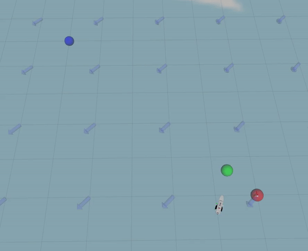
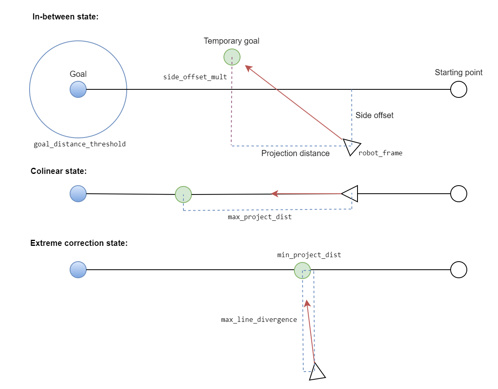

# tinyhelm waypoints planner

Based on the Simple Projecting Line Planner.

A local planner that takes two goals (last and next), and follows a projected goal that keeps it close to the line segment between the two goals. Designed to resist strong side forces, such as from wind or water current.



## Params

The frames are read from the global `/robot_frame` and `/planning_frame` (set in `helm.yaml`), everything else is private to the node and normally comes from the planner config loaded alongside it:

```yaml
tinyhelm_waypoints:
    # Any Z sent will be set to zero if true
    ignore_altitude: false

    max_linear_speed: 3.0
    max_turning_speed: 2.0
    max_vertical_speed: 10.0

    # If robot_frame is this far from the line, the projected distance will be min and scale to max when it's on the line.
    max_line_divergence: 1.5

    # The obstacle planner clears a corridor max_line_divergence wide, so half of this is kept as margin to hold the hull inside it.
    robot_width: 3.0

    # The carrot is projected at least/most this far ahead.
    min_project_dist: 0.3
    max_project_dist: 5.0

    # Distance at which the goal is considered reached.
    xy_distance_threshold: 1.0
    z_distance_threshold: 0.5

    # PID params for heading control.
    P: 2.0
    I: 0.002
    D: 65.0

    # If the robot frame is away from the line, the goal will be mirrored into the opposite direction and multiplied with this value.
    side_offset_mult: 0.8

    # Update rate, should be about the same as localization rate.
    rate: 30
```

See `tinyhelm_core/param/planner_asv.yaml` and `planner_auv.yaml` for the shipped surface and underwater tunings.

Here's a diagram showing the possible states of the planner, and which distances each parameter affects:



## Subscribed Topics

- `/waypoints/_goal` (PoseStamped), takes the current position as the starting point and moves towards the goal

- `/waypoints/_path` (Path), takes each two consecutive points and navigates along the line between them

- `/waypoints/_revise` (Path), replaces the remaining route with a corrected one, where the first pose is the line anchor rather than a goal

- `/waypoints/_clear` (Empty), stops all movement immediately

## Published Topics

- `/cmd_vel_waypoints` (Twist), publishes velocity for vehicle motion, muxed onto `/cmd_vel` by the helm core

- `/waypoints/_status` (ControllerStatus), latched controller state the helm core reacts to

- `/waypoints/_active` (Bool), latched navigation status

- `/waypoints/_plan` (Path), latched nav plan, also the entire route if given

- `/waypoints/_markers` (MarkerArray), publishes the debug markers shown above, throttled to 5 Hz

- `/waypoints/_vertical_target` (Float32), publishes the current altitude target

Topic names are hardcoded in the node, so the `controllers/waypoints` block in `helm.yaml` has to match them.

## Dynamic Reconfigure Params

Every param above can be changed at runtime:

- `ignore_altitude` (bool_t), if true, Z values will be disregarded.

- `max_linear_speed` (double_t), the maximum linear speed of the robot.

- `max_turning_speed` (double_t), the maximum speed at which the robot can turn.

- `max_vertical_speed` (double_t), the maximum vertical speed of the robot.

- `max_line_divergence` (double_t), the maximum distance that the robot can diverge from the line between the goals.

- `robot_width` (double_t), the width of the robot. The obstacle planner only guarantees a clear corridor `max_line_divergence` wide, so the planner reaches maximum correction at `max_line_divergence - robot_width / 2` instead, which keeps the hull inside the cleared corridor rather than just the origin of `robot_frame`. Leave at 0 to steer off the raw divergence.

- `min_project_dist` (double_t), the minimum projection distance for the goal.

- `max_project_dist` (double_t), the maximum projection distance for the goal.

- `xy_distance_threshold` (double_t), the horizontal distance at which a goal is considered reached.

- `z_distance_threshold` (double_t), the vertical distance at which a goal is considered reached.

- `P` (double_t), the proportional gain for the PID controller that controls the heading of the robot.

- `I` (double_t), the integral gain for the PID controller.

- `D` (double_t), the derivative gain for the PID controller.

- `side_offset_mult` (double_t), multiplier for the side projection of the robot's position.

- `rate` (int_t), the rate at which the robot updates its position and velocity.
